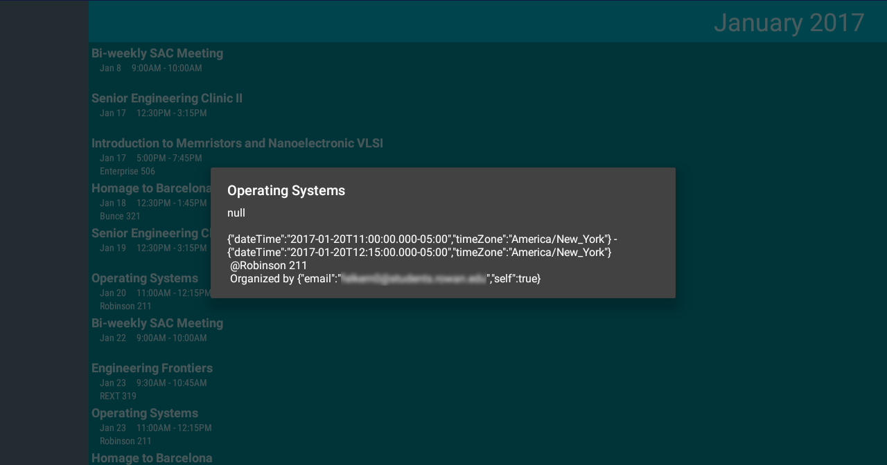

# Family-Calendar
A calendar that can be viewed by the whole family, on Android TV.

**(Now Available to Download)[https://play.google.com/store/apps/details?id=news.androidtv.familycalendar]**

Families have plenty of schedules that need to be kept, but how do you keep track? Digital calendar software make it easy for us to manage this. How do we make it accessible to families?

Family Calendar uses your Google Calendar account to show all of your events. You can view all your calendars, toggle which ones should be shown, and then view all of your events. By selecting one, you can view more information about it.

## Controls
The app is easy to control. First, it requires access to your contacts in order to access your Google Account. With this access, it will be able to read your calendar entries. Read the [privacy policy](PRIVACY.md) for more information about this.

Moving up and down will scroll through the list of events in Agenda-style. (Other types of UI, such as month view, may be implemented later down the line depending on user feedback. As always, contributions are welcome.)

If you scroll too far down or up, you will jump to the next or previous month respectively. Using a gamepad, the L and R shoulder buttons will also skip through months.

Pressing left will open the navigation drawer. Here, you are able to toggle which calendars should be visible. This can default to your settings elsewhere, or be customized based on family viewing preferences.

Additional features depend on user feedback and contributions.

## Screenshots
 
Viewing events in January.

 
Viewing all of my calendars in the navigation drawer.

 
Selecting one event to see more information about it.
